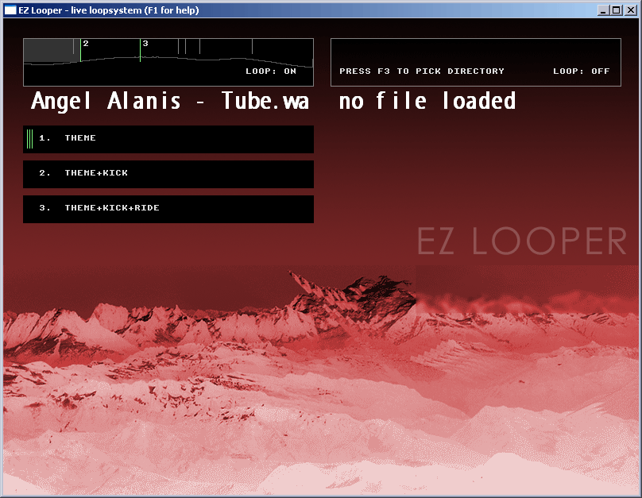
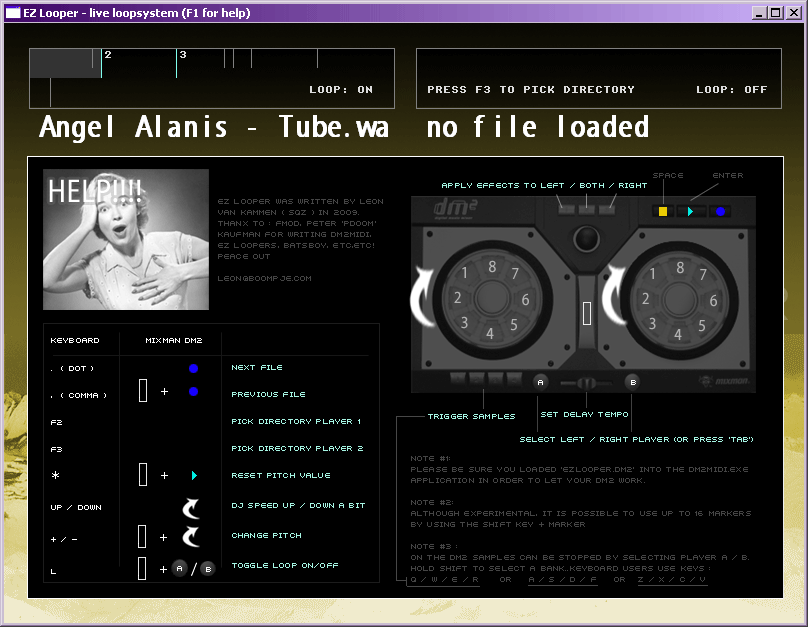
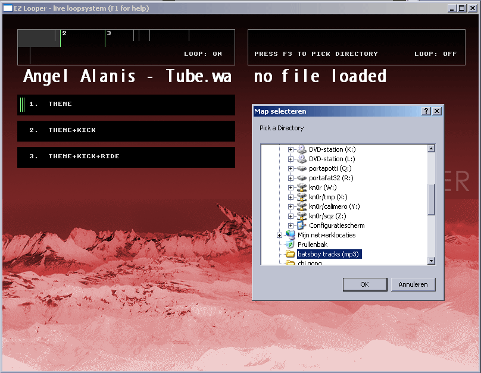
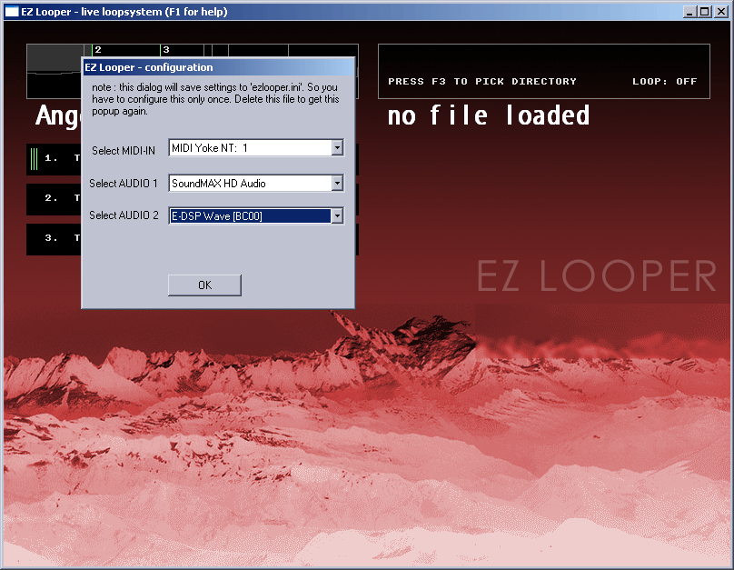

EZ Looper dm2 software
======================

### what is it?

EZ Looper is an application build for dj\'s and livemusicians, originally intended to control it with the MIDIMAN DM2 controller (still works). Its build in 100% pure C++. Basically its just a djplayer with :

* controllable by keyboard or a midicontroller 
* loopregions inside can be triggered (uses WAV markers) (beta).
* internal VST effects : lowpass/highpass filter + 2x dubdelay
* plays mp3/wav files
* jog/pitch tracks like any other cdplayer in the clubscene.
* GIF as background, so you can style the app to your own taste

### Why another djplayer?

First of all, I was not fully satisfied with the software which came with my mixman dm2 controller. When a producer/dj designs his liveset, sometimes sticking with minimalistic stuff can make things more pleasant. After trying zillions of dj-players, I concluded that it was better to redirect this energy towards building a minimalistic player. I wanted to create a simple loop tool, but it evolved into this since the looppoints arent really stable.

### Focus

The main focus is that you should be able to dj with your eyes closed. A lot of djplayers/sequencers have complex interfaces with tiny fonts, dangerous complex MIDI-options. The workflow should be : get on stage,start your laptop+program, close your laptop and party!

### Screenshots

 
 
 
 

### Download

[check the google code project here](http://code.google.com/p/ezlooper)

### Note

Chances for updates are very rare since I kind of abanded the idea which started this app.
