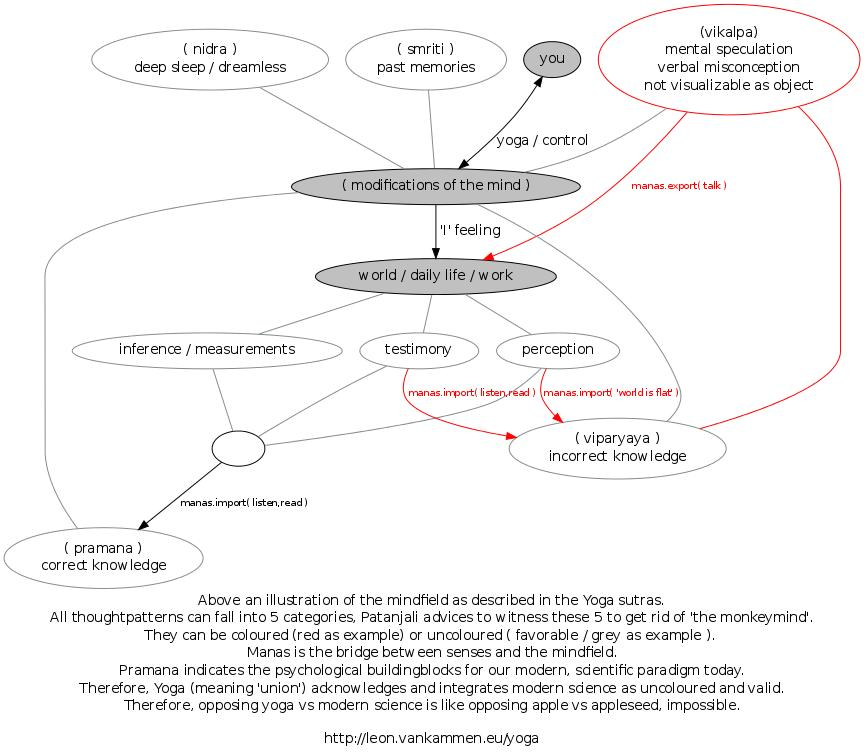

Patanjali Yoga Sutra 1.1
========================
(1.1 / 1.11)

Terminology
-----------
<ul>
  <li><a target="_blank" href="http://en.wikipedia.org/wiki/Purusha">you</a></li>
  <li><a target="_blank" href="http://en.wikipedia.org/wiki/Yoga">yoga / control</a></li>
  <li><a target="_blank" href="http://en.wikipedia.org/wiki/Fact">fact / skepsis</a></li>
  <li><a target="_blank" href="http://en.wikipedia.org/wiki/Perception">perception</a></li>
  <li><a target="_blank" href="http://en.wikipedia.org/wiki/Inference">inference</a></li>
  <li><a target="_blank" href="http://en.wikipedia.org/wiki/Testimony">testimony</a></li>
  <li><a target="_blank" href="http://fr.wikipedia.org/wiki/Viparyaya">(viparyaya) incorrect knowledge</a></li>
  <li><a target="_blank" href="http://en.wikipedia.org/wiki/Pram%C4%81%E1%B9%87a">(pramana) correct knowledge</a></li>
  <li><a target="_blank" href="http://en.wikipedia.org/wiki/Yoga-nidra">(nidra) deep sleep / dreamless</a></li>
  <li><a target="_blank" href="http://en.wikipedia.org/wiki/Smriti">(smriti) past memories</a></li>
</ul>
