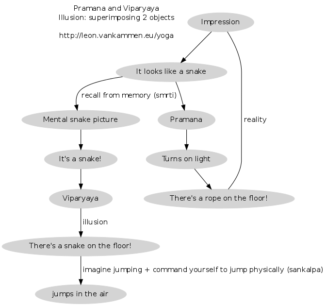
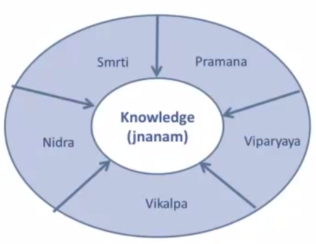

What is Knowledge
=================

The first chapters of the Yoga Sutras dive into this.
Reading multiple translations and commentaries on this can be helpful.
In this article, I tried to document A.G. Mohan's view.

# Pramana 

Literally means "proof" and "means of knowledge".
For now we call it 'correct knowledge'
Many translations done by Western people see this as the ultimate goal, probably
  because today's scientific paradigm was fueled by it.
 However Patanjali clearly mentions that Pramana,Vikalpa and Viparyaya are disturbances (vrittis) of the mind.

# Vikalpa

Vikalpa is a tricky one.
In short:

* something which will never manifest into reality 
* it is solely based on (the power of) words ('time flies')
* impossible to form a mental picture (think about 'time' / 'space' / 'infinite')

See [here](Vikalpa.html) for an indepth article.

# Viparyaya: The snake and the rope 

Needless to say, this is just an example.
In general it's good to have some survival-insticts and reflexes. 

# Sankalpa 

As seen in the last picture, Sankalpa is imagination (a mental picture) and a mental resolution/command in one thought.
One could imagine it like a picture which has the filename 'jump now.JPG'.

The message of the Upanishads Sutras (which the YS are based on) is : 

<i>`Root out sankalpa in wordly desires`</i>

# Roundup 

# More info 

Watch this excellent video by A.G. Mohan :

<iframe width="560" height="315" src="https://www.youtube.com/embed/r8CVdGzccT0" frameborder="0" allowfullscreen></iframe>
