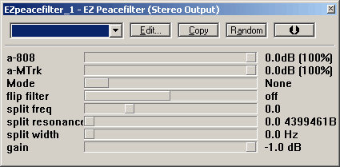

EZ Peacefilter VST/Buzz Plugin
==============================

This VST/Buzz plugin is called EZ peacefilter

### download 

* [win32 VST](res/EZpeacefilter-win32VST.zip) 
* [Buzz](res/EZpeacefilter-win32Buzz.zip)

### What is it?

Ever worked with a crossfader while deejaying? On the left side of the fader you hear record #1, and on the right side record #2. 

EZ Peacefilter works almost the same but with frequencies. It needs 2 inputs, and then it will split the two signals, so no overlap is created in the frequency spectrum. Why is this handy? Most of the time when you try to layer 2 'PHAT' sounds with subbass involved, the outcome sucks.

So next to phase-correction-toys, you can use this toy :)

`NOTE`: you need a VST-host which supports multiple inputs like [Buze](http://batman.no/buze) or REAPER
