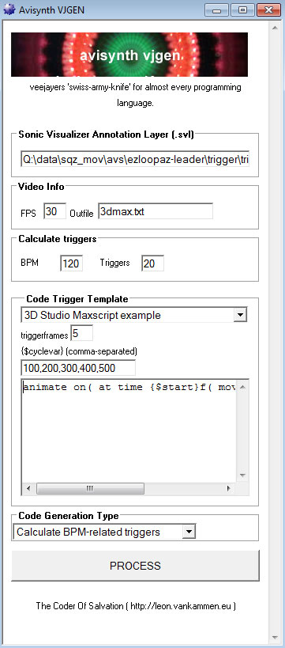
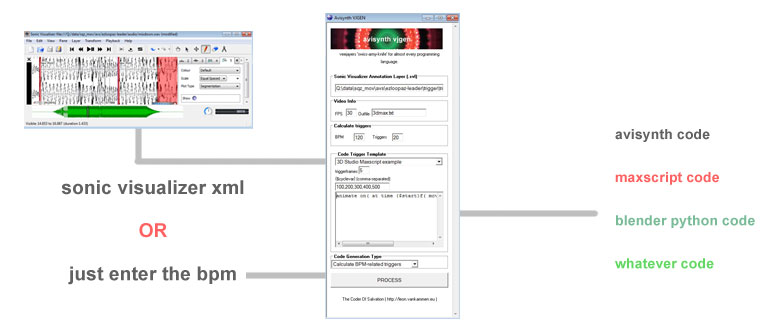

Avs-vjgen
=========

The UNIX-philosophy states:

  * Thy shall wear a unixbeard
  * Rule of Generation: Avoid hand-hacking; write programs to write programs when you can
  
(taken from the book *The art of Unix Programming*

Well the beard is still not there, but at some point I was working on a animationcode-generator, because I just had to write *too* much code.

### A tool was born ###

It bridges the gap between manually applying animationeffects, and audio analysation methods.
For now its beta and for private use only.
Who knows I will release it into the public someday

### The Problem ###

I wanted to create a video(script) using avisynth, which acts upon audio.
Also, I didnt wanted to use a realtime beatdetectionalgorythm (I wanted really tight stuff).
Then I discovered a free great trigger-editor/VAMP host called  <a href="http://www.sonicvisualiser.org/" target="_blank">'Sonic Visualizer'</a> which
can export an .svl textfile with beattriggers.

### What is it? ###

This application is for audiovisual scripters, and it allows them to use the same triggerdata in many scripting languages.
It generates animationcode for any scripting language you want.
Just enter the bpm (or upload a triggerfile), and it will generate the code.
This was made with audio/video beatsyncing/fx in mind.
If you get the idea, you can use it for any programming language.

### Why is this great? ###

Since this tool generates snippets of code, you can generate animation 'trigger' code in ANY scripting language or application.
You don't have to worry about 'how can I get this data into that program'.
Instead, you just generate animation-codesnippets for each application, in its own syntax.
For (animation) programmers this is great, especially if you focus on automated video content generation, or batch-processing of video.
It started out as a tool for generating avisynthcode & freeplugin-automation, but gradually evolved into a 'swiss-knife-for-audiovisualcoders' utility.

### Example video ###

The video below was made with 100% avisynth code & freeframe plugins. The effects are triggered by triggerdata (an xml which was produced by Sonic Visualizor's audio detection).
The 'avs-vjgen'-tool reads this xml, and generated the appropriate avisynth code.
The animated cubes were made with blender, which used python animation code, which was also generated with 'avs-vjgen'.

<iframe width="517" height="400" src="http://www.youtube.com/embed/tZtXsuIcqMs" frameborder="0" allowfullscreen></iframe>

### How ###

You just need to know the bpm of your audio, or make a triggerdata-file with the free utility <a href="http://www.sonicvisualiser.org/" target="_blank">'Sonic Visualizer'</a>.
The first is for the lazy, the latter for the purists.
Ofcoarse you can combine both methods, since you can generate and combine code as much as you like

(click image to enlarge)

### Example avs-vjgen output ###

**AVISYNTH triggercode**

    # BEGIN-OF-GENERATED-OUTPUT
    offset = Rand( clip.framecount-1 )
    cho = clip.Trim(offset,offset+14 )
    clip = Replace( clip, chop, 192,14 )
    offset = Rand( clip.framecount-1 )
    chop = clip.Trim(offset,offset+14 )
    clip = Replace( clip, chop, 206,14 )
    ....(and so on)
    # END-OF-GENERATED-OUTPUT
    
**MAXSCRIPT triggercode**

    # BEGIN-OF-GENERATED-OUTPUT
    # 3dsmax example to move object on every trigger
    animate on( at time 0f( move $[0,0,100]) )
    animate on( at time 15f( move $[0,0,200]) )
    animate on( at time 30f( move $[0,0,300]) )
    ....(and so on)
    # END-OF-GENERATED-OUTPUT

### Background ###

I wanted to easify generation of time-critical code for scripters.
Lots of time, when combining audio &amp; video, I wanted to trigger code at specific timestamps.
After lots of realtime experiences (by binding MIDI/OSC events to certain video-events), I had enough of it.
If your just after the data, these methods are often very unportable/obscure/complex and require 'recording' of data.
Also, often they relay on realtime analyzation of audio, which causes a lot of 'false triggers'.

I wanted just 1 file containing my triggerdata, which I can use in whatever application.
So, just to have great video content, synced to audio, we should get away from realtime applications.
However, it would be way to much work to write down code manually.
After lots of research I discovered avisynth was a rich videoscripting language with a respectable community.
So I have my scripting language, but now..how to get the triggers?

### VAMP / Sonicvisualiser ###

I discovered VAMP plugins, which are basically audiodetection algorythms.
Then I discovered a free great trigger-editor/VAMP host called  <a href="http://www.sonicvisualiser.org/" target="_blank">'Sonic Visualizer'</a>
Here you can load up an audiofile, set triggers by mouse (or by detectionalgorythms), and export the triggers to xml.

This was exactly what I wanted...the comfort of generating triggers, and the ability to set manual triggers.
Now I needed to convert these triggers to actual avisynth-code: avs-vjgen was born.

### Download ###

  * <a href="res/avs-vjgen-0.9b.zip" target="_blank">avs-vjgen-0.9b.zip</a>
  * <a href="res/avs-vjgen-exampleproject.zip" target="_blank">avs-vjgen-exampleproject.zip</a>

### Dependancies ###

  * Windows
  * Avisynth installed
