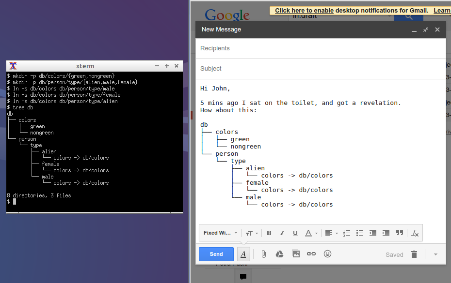

Getting ideas across by emailing ascii graphs using unix tree
=============================================================

# Problem

A picture is worth a thousand words.
At the same time: there are many techpeople who prefer to write text instead of creating pictures.
But how much does one need to get an idea across?

# Ultimate laziness: directories and symlinks!

Directories and symlinks are easy for people to manage.
There's this unix utility called `tree` which is available on almost
every platform.

That's it!
Just copy/paste the output of `tree` into your email client, and set the font to 'Fixed-width'.
Done!

# Does this work on our forum/webchat as well?

See for yourself by copy/pasting this:

    db
    ├── colors
    │   ├── green
    │   └── nongreen
    └── person
        └── type
            ├── alien
            │   └── colors -> db/colors
            ├── female
            │   └── colors -> db/colors
            └── male
                └── colors -> db/colors

# Background thoughts

Where do text and pictures meet in the middle?

    +---------------+
    |   Ascii art!  |---------> is laborous to write or mousedraw manually!
    +---------------+

Therefore generating it from the unix commandline, without exotic
 tools is attractive.

> Optionally one could even supply a bash oneliner in the email or post to your collegue can easily reproduce it.

# There are many tools out there!

Don't get me wrong here.
I love solutions like graphviz, gnuplot and mscgen and flowchart apps.
However `tree` would make a great balance between laziness and constructiveness.
