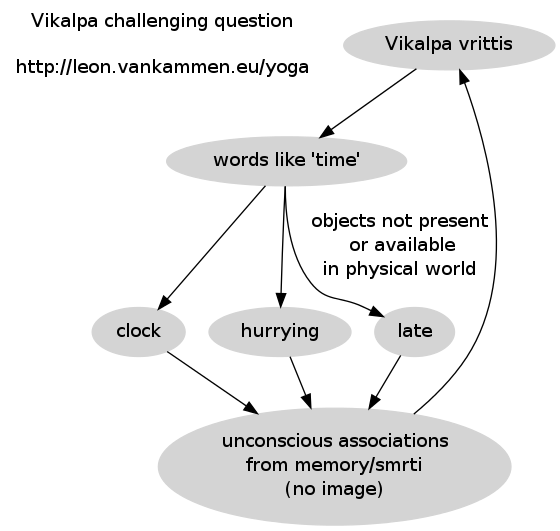

What is Vikalpa
===============

The first chapters of the Yoga Sutras dive into this.
Reading multiple translations and commentaries on this can be helpful.
In this article, I tried to document A.G. Mohan's view.

# Vikalpa

Vikalpa is a tricky one.
There are many different translations, but it let's start with my interpretation:

In other words: vikalpa vritti to me looks like a whirlpool of non-actual objects, which are limited to your personal history and experiences. Probably not the best advisor.

> TIP: whenever you are worrying, ask yourself whether you're dealing with vikalpa vrittis.

Since it's mentioned in the beginning of the YS, it really deserves attention.
The only person touching this topic I found was A.G. Mohan.
He emphasizes that the western translators did a great job in promoting the sutras. But in order to get really precise translations, the topic itself needs to be primary knowledge, and the english language should be secondary knowledge (and not vice versa).
He stressed the fact that Vikalpa is :

* something which will never manifest into reality 
* it is solely based on (the power of) words ('time flies')
* impossible to form a *direct* mental picture (think about 'time' / 'space' / 'infinite')

Please not the mentioning of the word *direct*.
Not to be confused with *indirect* associations which could eventually produce mental imagery (think neural networks).
He mentioned the following translations and puts them into categories:

* category #1: imagination

He advices against this translation, because: 

<i>`A mental resolution to move forwards freedom requires imagination of its execution. If vikalpa is taken as imagination and needs to be arrested (nirodha) then movement is not possible`</i>

* category #1: fancy
* category #1: fantasy 
* category #1: hallucination
* category #1: daydreaming
* category #1: wishful thinking 

He advices against this translation, because : 

<i>`these indicate absence of mental focus and mental instability. The practices of YS chapter 2 is perfect to help stabilizing the mind. The practices of YS chapter 1 however, is for the steady mind.`</i>

* category #2: abstract thinking 
* category #2: conceptualization

The problem I see with most translations is that they don't mention the absence of mental-pictures.
A.G. Mohan is not really precise about his opinion on this, however he insists:

<i>`Vikalpa vritti gives rise to the absence of characteristics.`</i>  

* category #3: metaphor/simile

He advices against this translation, because : 

`<i>In vikalpa there is no object (characteristic) for superimposition). In metaphor/simile there are"

> Example 'miracles'

Thinking about doing 'miracles' will be impossible to manifest, since the word 'miracle' has no real object in physical reality.
It's also impossible to create an mental image about the world 'miracle' itself.
Another problem with this word is that it's usually a synonym to 'impossible'.

> Example of something not vikalpa: 

an architect imagining a house will be able to manifest.

> Example 'pie in the sky'

Is not vikalpa since a mental picture can be formed *directly*.

# More info 

Watch this excellent video by A.G. Mohan :

<iframe width="560" height="315" src="https://www.youtube.com/embed/r8CVdGzccT0" frameborder="0" allowfullscreen></iframe>
