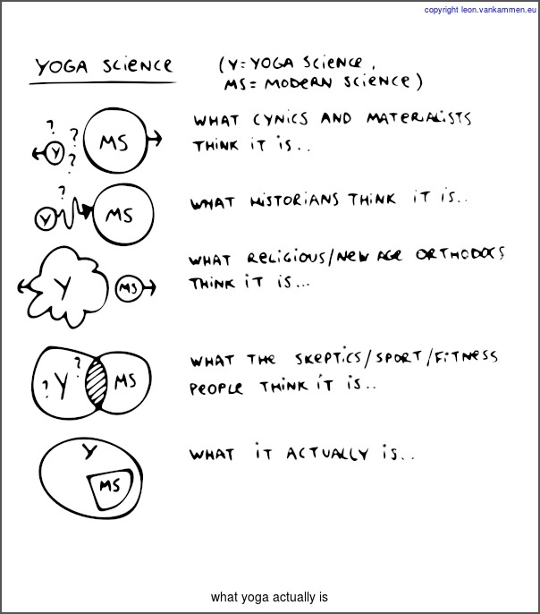

What is Yoga
============

Yoga describes how 'Pramana' (correct knowledge) can be verified using falsification, they are the psychological buildingblocks for our modern, scientific paradigm today.
Therefore, Yoga (meaning 'union') acknowledges and integrates modern science as uncoloured and valid.
Therefore, opposing yoga vs modern science is like opposing apple vs appleseed, impossible.
