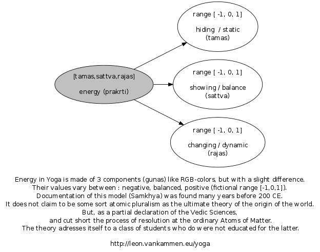
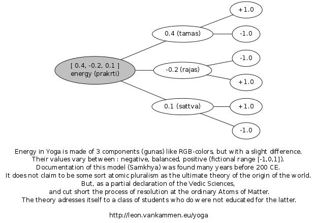

Yoga energy
===========
In Yoga, Energy <a target="_blank" href="http://en.wikipedia.org/wiki/Prakrti">(Prakrti)</a> consist of 3 components 
<a target="_blank" href="http://en.wikipedia.org/wiki/Gunas">(Gunas)</a> : 
<a target="_blank" href="http://en.wikipedia.org/wiki/Tamas">Tamas</a>,
<a target="_blank" href="http://en.wikipedia.org/wiki/Rajas">Rajas</a>,
<a target="_blank" href="http://en.wikipedia.org/wiki/Sattva">Sattva</a>

Other example
-------------

Terminology
-----------
<ul>
  <li><a target="_blank" href="http://en.wikipedia.org/wiki/Rajas">Rajas</a></li>
  <li><a target="_blank" href="http://en.wikipedia.org/wiki/Sattva">Sattva</a></li>
  <li><a target="_blank" href="http://en.wikipedia.org/wiki/Tamas">Tamas</a></li>
  <li><a target="_blank" href="http://en.wikipedia.org/wiki/Prakrti">Prakrti</a></li>
  <li><a target="_blank" href="http://en.wikipedia.org/wiki/Gunas">Gunas</a></li>
</ul>

