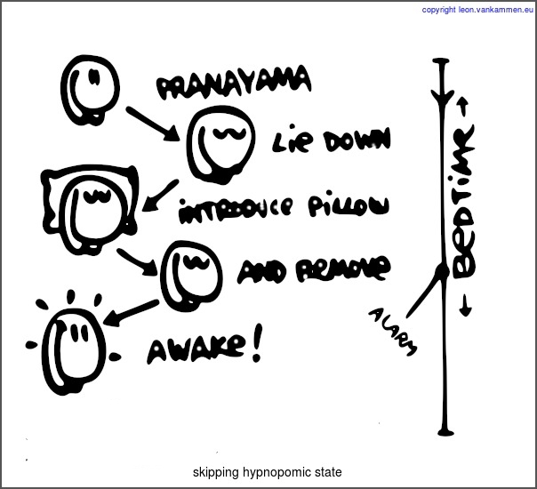

Visual Coffee Sutra #2
======================
Feeling energetic without coffee is easy.
If you have to wakeup at 07:00, try setting the alarm at 06:00, remove the pillow and see what happens.

Coffee vs Hypnopompic vs Slow Digestion
---------------------------------------
Tiredness, Slowness and [Hypnopompic](http://en.wikipedia.org/wiki/Hypnopompic) symptoms are usually 'solved' by coffee.
People with slow digestion-problems also usually 'solve' it with coffee.
Coffee as an addiction however, has many [obstacles](http://en.wikipedia.org/wiki/Health_effects_of_coffee)
Ofcoarse, all these obstacles can introduce other obstacles as well.
Why not introduce fibers/linseed/tea instead (for fast digestion) and respect your biorythms, instead of hijacking your system with coffee habitually?

Background
----------
Lying down, and waking up can can cause feelings of drowsiness.
Therefore, divide your sleepingritual into 2 stages (with / without pillow):

  * deep sleep associates with pillow (bent headposition)
  * wake-state associates without pillow (flat headposition).

Ever wondered why yogi's prefer meditating with a straight spine?
After practicing this few times, removing the pillow can reverse the drowsiness-process, and skip [hypnopomic](http://en.wikipedia.org/wiki/Hypnopompic) symptoms when waking up.

