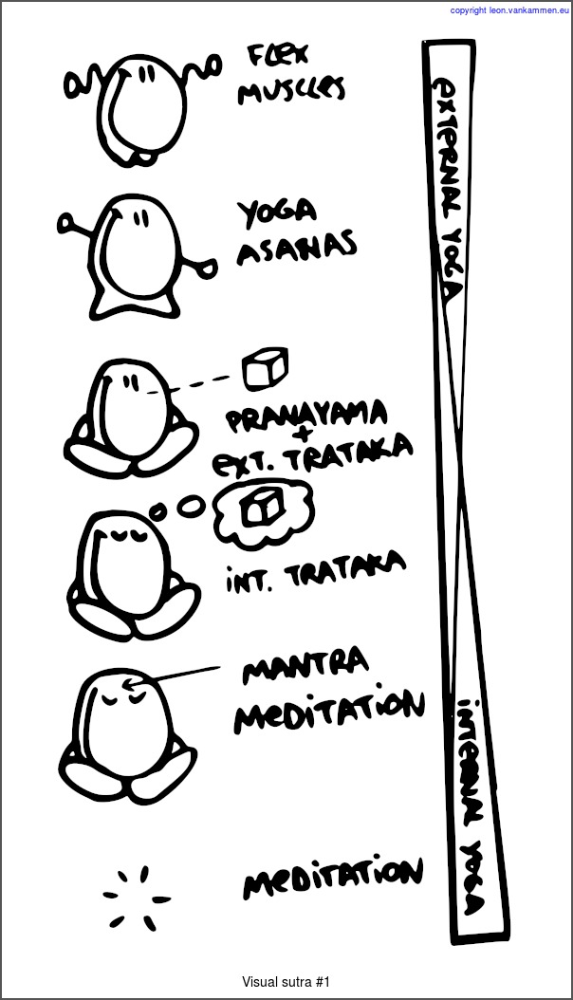

Visual Yoga Sutra #1
====================
(click in image for detailed information)

<MAP NAME="mymap">
  <AREA SHAPE=RECT COORDS="44,28,408,188"   HREF="http://en.wikipedia.org/wiki/Dance" ALT="Dance, Move Freely, Loosen up joints" target="_blank"/>
  <AREA SHAPE=RECT COORDS="44,188,396,350"  HREF="http://en.wikipedia.org/wiki/List_of_asanas" ALT="Control Body, Do yoga postures" target="_blank"/>
  <AREA SHAPE=RECT COORDS="44,358,420,447"  HREF="http://en.wikipedia.org/wiki/Pranayama" ALT="Control Mind, Do some controlled breathing" target="_blank"/>
  <AREA SHAPE=RECT COORDS="219,464,442,500" HREF="http://en.wikipedia.org/wiki/Trataka" ALT="Relax eyes/thought, Do some external/stage1 gazing" target="_blank"/>
  <AREA SHAPE=RECT COORDS="44,513,432,670"  HREF="http://en.wikipedia.org/wiki/Trataka" ALT="Narrow focus mind, visualize object internally/stage2 gazing" target="_blank"/>
  <AREA SHAPE=RECT COORDS="44,692,444,855"  HREF="http://en.wikipedia.org/wiki/Mantra" ALT="Exclude physical thought, repeat mantra" target="_blank"/>
  <AREA SHAPE=RECT COORDS="44,867,453,1011"  HREF="http://en.wikipedia.org/wiki/Samadhi" ALT="Drop all thought, absorb in deepspace" target="_blank"/>
</MAP>

